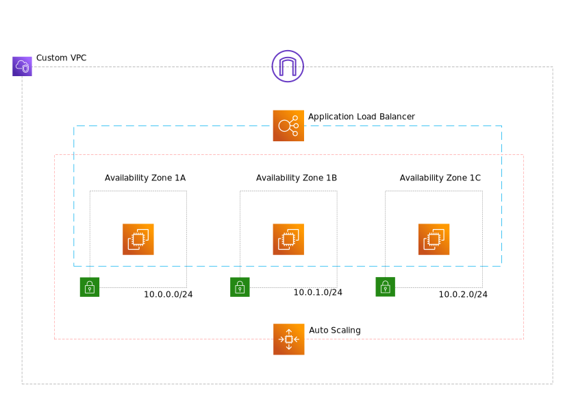

# Create a scalable AWS infrastructure using Terraform

This module will build the following infrastructure: 


* custom VPC
* a new subnet in each Availability Zone
* an Internet Gateway,
* an Application Load Balancer,
* an Auto Scaling group and a launch configuration.

## Usage

You should have IAM user AWS credentials saved on the host. Terraform supports the same authentication mechanisms as all AWS CLI and SDK tools so feel free to provide it the way you prefer. Initialize terraform:

```terraform init```

and build the infrastructure:

```terraform apply```
